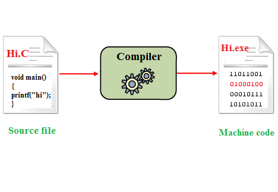

<!-- PROJECT LOGO -->
<br />
<p align="center">
  <a href="https://github.com/yohanalexander/quase-compiler">
    
  </a>

  <h1 align="center">Quase Compiler</h1>

  <p align="center">
    Compilador da linguagem Quase!
    <br />


<!-- ABOUT THE PROJECT -->
## Sobre o projeto

Implementação usando a ferramenta `Sablecc` do compilador de uma linguagem fictícia quase, para mais informações consulte a gramática no formato `E-BNF` da linguagem.

<!-- GETTING STARTED -->
## Funcionamento

### Pré-requisitos

Para o funcionamento adequado são necessárias ferramentas para compilação de código java, e o compilador de compiladores `Sablecc` para gerar o parser da linguagem.
* Sablecc
* Java

Em sistemas linux utilize os comandos no terminal:
```sh
sudo apt install sablecc
sudo apt install default-jdk
```

### Geração do parser
Com as ferramentas instaladas para gerar o parser basta executar o  `Sablecc` no arquivo formatado da gramática:
```sh
sablecc quase.sable
```

<!-- USAGE EXAMPLES -->
### Uso
Para testar se o código esta no formato adequado da linguagem execute a main no diretório raiz do projeto:
```sh
javac quase/Main.java
java -cp . quase/Main
```
Caso o código alvo não apresente erros, será apresentada a estrutura em árvore das classes.

